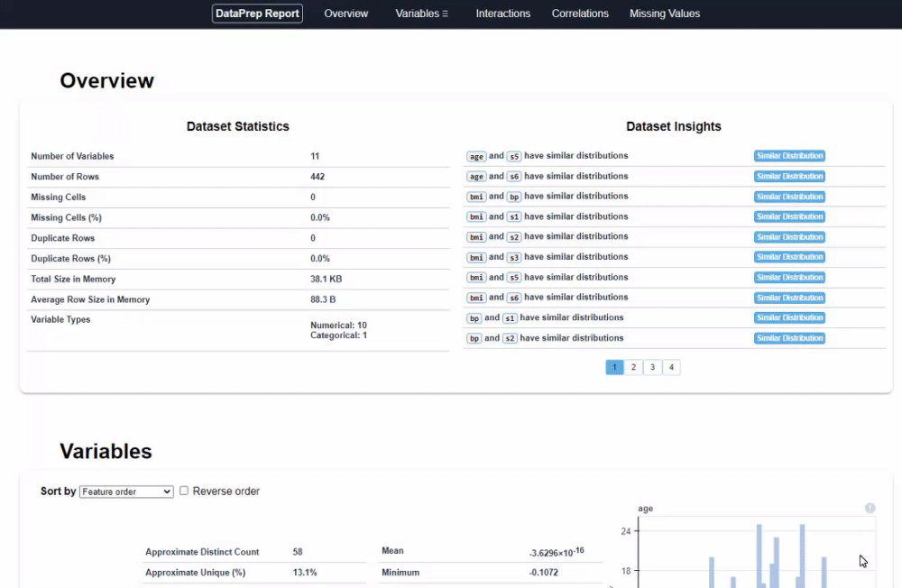
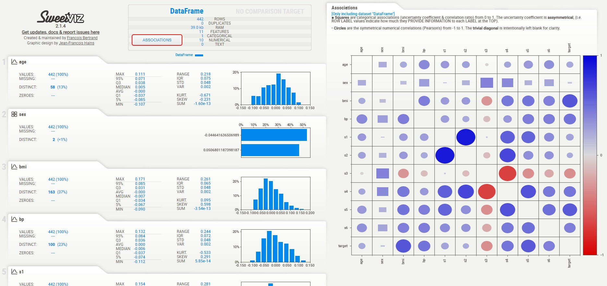

# AutoEDA

## 目的
合併整理一些自動EDA工具，用來做快速資料初步探索報告


## 安裝

```sh
pip install -r requirements.txt
```

## 使用

### Step1: 將要分析的資料放置到data資料夾
+ 支援`.csv`或`.xlsx`檔案


### Step2: 執行分析腳本

```sh
python main.py
```


### Step3: 查看分析結果
+ 若以資料集為`diabetes.csv`為例
    + 會在`output/`下建立一個`diabetes/`資料夾
    + 包含三個不同工具分析的EDA結果html網頁


## 輸出報表

### 1-DataPrep
除了基本數值以外，還會提供一些額外資訊
+ 提供Dataset Insights
    + 例如某兩個欄位有相似的分佈



### 2-pandas_profiling
除了基本數值以外，還會提供一些額外資訊
+ 記憶體佔用、無限值數量
+ 會提供**alert**標記說可能這筆資料有些什麼需要注意的地方
    + 例如某兩個欄位之間高度相關


### 3-sweetviz
比較簡便，包含
+ 各欄位之間的Correlation
+ 每個欄位的
    + 類別比例 or 數值分佈
    + 各種統計值：MAX, 95%, Q3, MEDIAN, AVG, Q1, 5%, MIN, RANGE, IQR, STD, VAR, KURT, SKEW, SUM
    + 零值數量、缺失值數量、相異值數量


